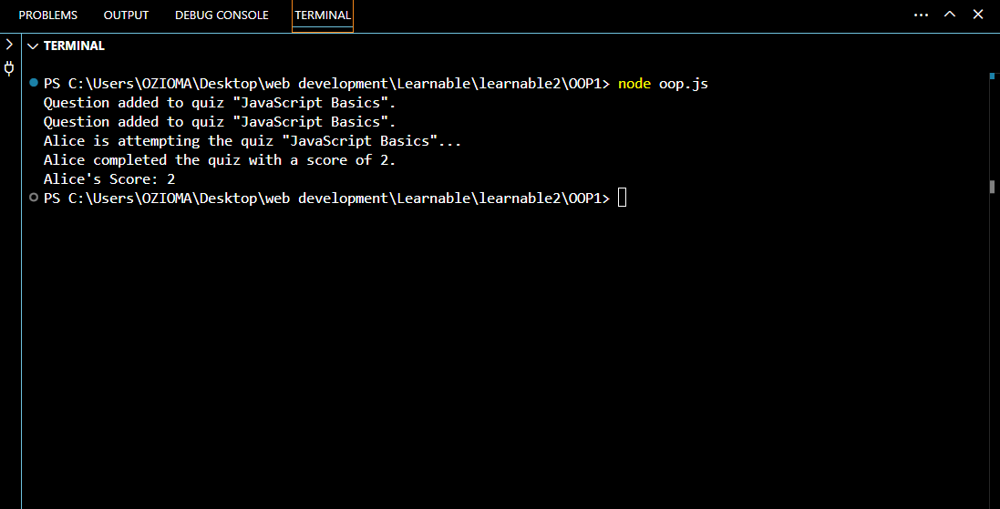

# Online Quiz System

## System Overview

The **Online Quiz System** is a simple web-based application designed to manage quizzes and participants programmatically. This system allows you to create quizzes, add questions, and simulate quiz participation by users. It also tracks scores and provides functionality for viewing quiz results.

---

## Features

1. **Quiz Management**

   - Create and manage quizzes with unique IDs and titles.
   - Add questions dynamically to a quiz.

2. **Participant Interaction**

   - Register participants with unique IDs and names.
   - Simulate quiz attempts and calculate scores.

3. **Dynamic Scoring System**
   - Automatically scores participants based on the number of questions in a quiz.

---

## Class Diagram

The UML class diagram below illustrates the structure of the system:

[View Class Diagram on Google Drive](https://drive.google.com/file/d/1OENbALBnY02nku0NGV_HV5C0MQDCsrA_/view?usp=sharing)

---

## Code Implementation

The code implementation is saved in the file `oop.js`. It includes the following classes:

### **Quiz Class**

- Tracks quizzes with unique IDs, titles, and a collection of questions.
- Methods:
  - `addQuestion(question)`: Adds a question to the quiz.
  - `startQuiz()`: Displays all questions in the quiz.

### **Participant Class**

- Represents participants with unique IDs, names, and scores.
- Methods:
  - `attemptQuiz(quiz)`: Simulates quiz participation and calculates the participant's score.
  - `viewScore()`: Displays the participant's score.

---

## How to Run

1. **Install Node.js**  
   Ensure you have Node.js installed. You can download it [here](https://nodejs.org/).

2. **Clone the Repository**  
   Clone this repository to your local machine using:

   ```bash
   git clone https://github.com/Ozioma45/quiz-app-oop.git
   ```

3. **Navigate to the Directory**

   ```bash
   cd quiz-app-oop
   ```

4. **Run the Code**  
   Execute the file using Node.js:
   ```bash
   node oop.js
   ```

---

## Example Execution Output

Here’s an example of the output generated when the system is executed:



---

## Repository Structure

```
root/
├── oop.js            # JavaScript code file containing the implementation
├── execution.png     # Screenshot of the code execution output
├── README.md         # Documentation for the project
```

---

## License

This project is licensed under the MIT License.

---

## Author

**Ozioma Egole**  
Email: [oziomaegole@gmail.com]  
GitHub: [https://github.com/Ozioma45)]

```

```
